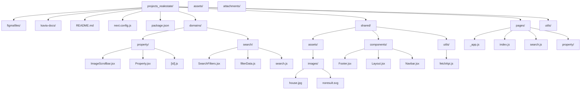

# Architecture & Folder Structure: projects_realestate

This document provides an overview of the folder organization of the `projects_realestate` Next.js application after its migration to a Domain Driven Design (DDD) structure for improved maintainability, collaboration, and feature scalability.

---

## High-Level Folder Diagram

---

## Directory Overview

- **domains/**:  
  Contains feature-specific logic, grouped by major business domains.  
  - `property/`: UI and logic for single property views and galleries.  
  - `search/`: Filtering, auto-complete, and search result logic.

- **shared/**:  
  Holds common elements shared by all domains.  
  - `components/`: Header, footer, layout, and other reusable UI pieces.  
  - `utils/`: Common data fetching and helpers.  
  - `assets/images/`: Central image storage.

- **pages/**:  
  Next.js page entrypoints; minimal business logic, instead delegate to domain/shared components.

- **kavia-docs/**:  
  Project architectural, analysis and documentation.

- **assets/, attachments/, figmafiles/**:  
  Reserved for external files, static assets, attachments, and design sources as needed.

- **next.config.js, package.json**:  
  Configuration, dependencies and project setup.

---

For migration help or component placement, see the README "Migration" section or reach out to the maintainers.

